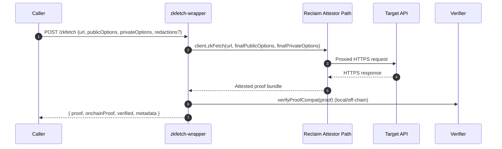

# zkTLS Architecture: Reclaim Protocol's Proxy Attestor Model

## Summary

**What does the client do?** → **Connects through attestor proxy, generates ZK proofs locally (Groth16), creates claims with selective disclosure**

**What do attestors do?** → **Proxy the HTTPS connection, observe encrypted TLS traffic, sign attestations (ECDSA)**

**How they work together?** → **Attestors proxy traffic → Observe encrypted data → Client generates ZK proof (Circom + snarkjs/Groth16) → Client sends claim with embedded ZK proof to attestor → Attestor verifies ZK proof using attestor-core → Attestor signs with ECDSA only if ZK valid → Off-chain verifiers (js-sdk) check ECDSA signatures (trust attestor's ZK verification) → On-chain verifiers check only ECDSA (trust attestor)**

**Important:** Reclaim uses real zkSNARKs (Groth16) via `@reclaimprotocol/zk-symmetric-crypto` library with Circom circuits for proving knowledge of TLS encryption keys without revealing them. This enables true selective disclosure.

**Where ZK Proof is Verified:**
- ✅ **Attestor-core**: Verifies ZK proof before attestor signs (Groth16 verification)
- ❌ **js-sdk**: Does NOT verify ZK proof (trusts attestor's ECDSA signature)
- ❌ **On-chain contracts**: Do NOT verify ZK proof (trusts attestor, gas efficient)
- 🔒 **Trust Model**: Attestor only signs if ZK proof is valid

### Runtime Baseline in This Repo (2026)

- `@reclaimprotocol/zk-fetch`: `1.0.0`
- `@reclaimprotocol/js-sdk`: `5.x`
- js-sdk `verifyProof(...)` may return a structured object (for example, with `isVerified`) instead of only a boolean.
- `useTee: true` is supported per request options.
- Newer zkFetch flows include OPRF-style redaction controls.
- Current Reclaim documentation tracks a modernized proving engine path (`stwo`).
- Legacy `snarkjs`/Groth16 compatibility paths remain relevant in migration and interoperability scenarios.

### Verification Compatibility in Wrapper (2026)

Current wrapper logic normalizes verification output:
- `normalizeVerifyResult(result)` converts both boolean and object-shaped verification results into a strict boolean.
- `verifyProofCompat(proof)` first calls `verifyProof(proof, { dangerouslyDisableContentValidation: true })`.
- Then falls back to `verifyProof(proof)`.

This keeps verification behavior stable across js-sdk response shapes and witness/network variability.

---

## Detailed Architecture

### 1. Connection Flow (Via Attestor Proxy)

```
┌─────────────────────────────────────────────────────────────┐
│                    zkfetch-wrapper                          │
│                                                             │
│  1. ReclaimClient.zkFetch(url, publicOpts, privateOpts)     │
│     ↓                                                       │
│  2. Connect to Reclaim Attestor Proxy                       │
│     (NOT direct to target API!)                             │
└──────────────────┬──────────────────────────────────────────┘
                   │
                   ▼
┌─────────────────────────────────────────────────────────────┐
│              Reclaim Attestor Proxy                         │
│         (wss://attestor.reclaimprotocol.org)                │
│                                                             │
│  3. Proxy HTTPS request to target API                       │
│     ↓                                                       │
│  4. Observe encrypted TLS traffic:                          │
│     ✓ TLS handshake (encrypted)                             │
│     ✓ Encrypted HTTP request                                │
│     ✓ Encrypted HTTP response                               │
│     ✓ Domain/certificate verification                       │
│     ✓ Timestamp session                                     │
│     ↓                                                       │
│  5. Sign attestation on encrypted transcript:               │
│     - "I witnessed encrypted traffic to api.aa.com"         │
│     - "Certificate valid, domain correct"                   │
│     - "Timestamp: 1734364800"                               │
│     - "Transcript hash: 0x..."                              │
└──────────────────┬──────────────────────────────────────────┘
                   │
                   ▼
┌─────────────────────────────────────────────────────────────┐
│              Target API (e.g., api.aa.com)                  │
│                                                             │
│  - Sees connection from attestor proxy (not your server)    │
│  - Unaware of zkTLS (normal HTTPS)                          │
│  - Returns encrypted response                               │
└─────────────────────────────────────────────────────────────┘
```

**Key Point:** Attestors **proxy the connection** and **observe encrypted traffic in real-time**, not just verify afterward.

---

### 2. Local ZK Proof Generation & Claim Creation

```
┌─────────────────────────────────────────────────────────────┐
│                    zkfetch-wrapper                          │
│                                                             │
│  6. Receive response from API (through attestor proxy)      │
│     ↓                                                       │
│  7. Decrypt locally (have TLS session keys)                 │
│     ↓                                                       │
│  8. Generate ZK proof locally:                              │
│     - Use @reclaimprotocol/zk-symmetric-crypto              │
│     - Circom circuits (ChaCha20/AES-CTR)                    │
│     - snarkjs/gnark backend (Groth16)                       │
│     - Prove knowledge of encryption keys                    │
│     - WITHOUT revealing the keys                            │
│     ↓                                                       │
│  9. Create claim with ZK proof:                             │
│     - Extract relevant data (e.g., booking ID)              │
│     - Apply selective disclosure (hide credit card, SSN)    │
│     - Embed ZK proof in claim                               │
│     - Hash identifier, parameters, context                  │
│     - Send to attestor for signing                          │
│     ↓                                                       │
│ 10. Receive attestor ECDSA signature and create bundle:     │
│     {                                                       │
│       claimInfo: { provider, url, method },                 │
│       signedClaim: {                                        │
│         claim: { identifier, owner, timestamp },            │
│         signatures: ["0xATTESTOR_SIG"]  // From step 5      │
│       },                                                    │
│       witnesses: [{                                         │
│         id: "attestor_1",                                   │
│         url: "wss://attestor.reclaimprotocol.org:444/ws"    │
│       }],                                                   │
│       extractedData: { data: "..." }  // With redactions    │
│     }                                                       │
└─────────────────────────────────────────────────────────────┘
```

**Key Point:** ZK proof is generated **locally** but relies on **attestor's observation** of the encrypted transcript for trust.

---

### 3. End-to-End Flow

```
┌──────────────┐
│  zkfetch-    │
│  wrapper     │
└──────┬───────┘
       │
       │ 1. zkFetch("https://api.aa.com/book")
       ▼
┌──────────────────────┐
│   Reclaim Attestor   │  2. Proxy HTTPS connection
│   (MITM Proxy)       │  3. Observe encrypted TLS traffic
└──────┬───────────────┘
       │
       │ 4. Forward encrypted request
       ▼
┌──────────────────────┐
│   api.aa.com         │  5. Process request
│   (Target Server)    │  6. Return encrypted response
└──────┬───────────────┘
       │
       │ 7. Forward encrypted response
       ▼
┌──────────────────────┐
│   Reclaim Attestor   │  8. Sign attestation:
│                      │     "Witnessed encrypted traffic"
└──────┬───────────────┘
       │
       │ 9. Return: encrypted data + signature
       ▼
┌──────────────┐
│  zkfetch-    │  10. Decrypt locally
│  wrapper     │  11. Generate ZK proof
│              │  12. Bind to attestor signature
│              │  13. Return final signed proof
└──────────────┘
```

---

### 3.1 Current Wrapper API Execution Flow (2026)



Current endpoint set in wrapper:
- `POST /zkfetch`: Generate proof, run local verification, optionally transform for on-chain usage.
- `POST /verify`: Off-chain verification endpoint using `verifyProofCompat`.
- `POST /transform-onchain`: Convert proof for contract-facing structures.
- `GET /health`: Service/mode health (`production` vs `mock`).

---

## Role Breakdown

### Your zkfetch-wrapper (Proof Generator)

**Responsibilities:**
- ✅ Connect to Reclaim attestor proxy
- ✅ Decrypt TLS session data locally
- ✅ Generate cryptographic ZK proof (using snarkjs circuits)
- ✅ Apply selective disclosure (redactions)
- ✅ Bind proof to attestor's signature

**Has Access To:**
- ✅ Session keys (for decryption)
- ✅ Plaintext API response
- ✅ Private headers (Authorization tokens)

**Does NOT:**
- ❌ Connect directly to target API
- ❌ Share session keys with attestors
- ❌ Reveal redacted fields to anyone

---

### Reclaim Attestors (Proxy + Attestation Network)

**Responsibilities:**
- ✅ Proxy HTTPS traffic to target API
- ✅ Observe encrypted TLS transcript in real-time
- ✅ Verify domain/certificate validity
- ✅ Timestamp the session
- ✅ Sign attestation on encrypted transcript integrity

**Observes (Encrypted):**
- ✅ TLS handshake
- ✅ Encrypted HTTP request/response
- ✅ Server certificate
- ✅ Domain name

**Never Sees (Due to TLS + ZK Redaction):**
- ❌ Plaintext HTTP body
- ❌ Full session keys
- ❌ Private headers (Authorization tokens)
- ❌ Redacted response fields

**Why Needed:**
- Prevents self-signing attacks
- Provides decentralized trust
- Enables on-chain verification
- Timestamp validation
- Domain/certificate attestation

---

## Trust Model

### Reclaim's Security Assumptions

**✅ You trust:**
- Majority-honest attestor network (decentralized, staked, slashable)
- TLS/HTTPS infrastructure (same as normal web browsing)
- Certificate Authorities (same as all HTTPS)

**⚠️ Attestors can (theoretically):**
- See you're making a request to `api.aa.com`
- Observe timing/size of encrypted traffic
- Know when you're using the service

**✅ Attestors CANNOT:**
- Decrypt your TLS traffic (don't have session keys)
- See private headers (encrypted + redacted)
- See redacted response fields (ZK proof hides them)
- Forge your proof (don't have your keys)

### Trust Trade-off

```
MPC-TLS (e.g., TLSNotary, Opacity):
  ✓ No trusted proxies (full multi-party computation)
  ✗ Slower, more complex, higher cost
  ✗ Requires specialized protocols

Reclaim Protocol (Proxy Attestor Model):
  ✓ Fast, cheap, simple integration
  ✓ Decentralized attestor network
  ✗ Trust assumption: honest majority attestors
  ✗ Attestors see encrypted traffic metadata
```

**Reclaim optimizes for:** Performance + ease of use, with decentralization mitigating trust assumptions.

---

## What Attestors Actually Verify

When traffic passes through attestors, they verify/attest:

1. **TLS Certificate Chain**
   - Valid signature from trusted CA?
   - Domain matches requested URL?
   - Not expired?
   - Proper certificate chain?

2. **Encrypted Transcript Integrity**
   - TLS handshake valid?
   - Encrypted data not tampered with?
   - Hash matches claimed transcript?

3. **Application Authorization**
   - Is your APP_ID registered?
   - Is this URL allowed for your app?
   - Within rate limits?

4. **Timestamp Validation**
   - Is the request timestamp reasonable?
   - Not a replayed old session?

**What attestors DON'T verify:**
- ❌ Plaintext content (encrypted by TLS)
- ❌ Whether the server's data is "correct" (garbage in, garbage out)
- ❌ Your redaction logic (happens locally in ZK proof)

---

## Security Properties

### What's Cryptographically Proven

✅ **By the TLS connection (via attestor):**
- Traffic went through encrypted HTTPS
- Server certificate is valid
- Domain matches (api.aa.com)
- Traffic not tampered in transit

✅ **By your ZK proof:**
- You can decrypt the encrypted response
- Decrypted data matches claimed values
- Redactions are applied correctly
- Response contains specified values (via responseMatches)

✅ **By attestor signatures:**
- An independent party witnessed the encrypted traffic
- Proof wasn't self-signed
- Timestamp is valid
- Multiple attestors agreed (decentralized)

### What's NOT Proven

❌ The server gave you the "correct" data (server could lie)
❌ You queried the right endpoint (you could query `/fake-data`)
❌ The data represents reality (API could return fake booking)

**Reclaim proves:** "This encrypted response came from this domain via TLS, witnessed by attestors"
**Reclaim does NOT prove:** "This response is true/accurate/correct"

---

## Privacy Guarantees

### What You Control (Private)

**Private from attestors:**
- ✅ Session keys (stay on your side)
- ✅ Private headers (Authorization: Bearer token)
- ✅ Redacted response fields (credit card, SSN, etc.)
- ✅ Full plaintext response body

**Private from verifiers (on-chain/off-chain):**
- ✅ Everything redacted via ZK proof
- ✅ Private headers
- ✅ Full response (only extracted/revealed parts shown)

### What Attestors See

**Metadata (always visible):**
- ❌ Target domain (api.aa.com)
- ❌ Request timing
- ❌ Encrypted traffic size
- ❌ Your APP_ID

**Encrypted data (not plaintext):**
- ❌ Encrypted HTTP request/response
- ❌ TLS handshake details
- ❌ Certificate information

---

## Comparison: Reclaim vs Alternatives

### Reclaim Protocol (Proxy Attestor Model)
```
✓ Fast (~10-15 seconds proof generation)
✓ Easy integration (npm install, simple API)
✓ Cheap (no heavy MPC computation)
✓ Decentralized attestors (staked, slashable)
✗ Trust assumption: honest majority attestors
✗ Attestors see encrypted traffic metadata
```

### MPC-TLS (TLSNotary, Opacity)
```
✓ No trusted proxies (full multi-party computation)
✓ Stronger privacy (no single party sees metadata)
✗ Slower (complex MPC protocols)
✗ More expensive (computational overhead)
✗ Harder integration (specialized protocols)
```

### Traditional API (No Proof)
```
✓ Simple, fast, cheap
✗ No proof of authenticity
✗ Can't share trustlessly
✗ Server knows everything
✗ No selective disclosure
```

---

## Selective Disclosure Behavior in Current Tests (2026)

Patterns that usually work well:
- Use `responseMatches` to prove required facts exist.
- Use redactions to hide sensitive fields while preserving proof utility.
- Keep matching and redaction scopes intentional.

Known practical caveat in current tests:
- Certain combinations of sibling/child-field matches plus redactions can be brittle.
- A known failing mode returns `Response does not contain ...`.
- Prefer matching stable parent context and redacting nested sensitive values when possible.

## On-Chain Boundary and Operations (2026)

- `transformForOnchain(proof)` prepares proof material for contract-facing structures.
- Wrapper on-chain flow validates claim/signature acceptance, not full remote HTTPS transcript re-execution on-chain.
- Start wrapper from the correct working directory so `.env` is loaded as expected.
- If behavior is inconsistent, confirm no stale server is bound to port `8003`.
- Keep `zk-fetch` and `js-sdk` versions aligned when upgrading.

---

## Real-World Flow Example

### Booking Flight with zkTLS

```
1. Agent B calls zkfetch-wrapper
   POST /zkfetch {
     "url": "https://api.aa.com/book",
     "publicOptions": { "from": "NYC", "to": "LON" },
     "privateOptions": {
       "headers": { "Authorization": "Bearer SECRET" },
       "responseRedactions": ["$.payment.credit_card"]
     }
   }

2. zkfetch-wrapper → Reclaim Attestor
   - Attestor proxies request to api.aa.com
   - Attestor observes encrypted TLS traffic
   - Attestor verifies certificate for api.aa.com

3. api.aa.com processes booking
   - Returns encrypted response: {
       "booking_id": "AA12345",
       "payment": {"credit_card": "4111-1111-1111-1111"}
     }

4. Reclaim Attestor signs attestation
   - "I witnessed encrypted traffic to api.aa.com"
   - "Certificate valid, timestamp: 1734364800"
   - Signature: 0xATTESTOR_SIG

5. zkfetch-wrapper receives encrypted data + signature
   - Decrypts locally with session keys
   - Generates ZK proof:
     * Proves decryption is correct
     * Redacts credit card: "REDACTED"
     * Binds to attestor's signature

6. Returns to Agent B:
   {
     "success": true,
     "data": {
       "booking_id": "AA12345",
       "payment": {"credit_card": "REDACTED"}
     },
     "proof": {
       "signedClaim": {"signatures": ["0xATTESTOR_SIG"]},
       "witnesses": [{"url": "wss://attestor..."}]
     }
   }

7. Agent A verifies proof on-chain
   - Checks attestor signatures (witnesses)
  - Verifies contract-required signed claim fields
   - Confirms booking_id without seeing credit card

### Payload Snapshot (2026-07-21)

Source artifacts used during validation:
- `proof-structure.json`
- `generated_proof.json`

Note: identifiers, timestamps, and extracted values vary by run.

Example request intent (`tests/test-httpbin-origin.js` pattern):

```json
{
  "url": "https://httpbin.org/get",
  "publicOptions": {
    "method": "GET",
    "headers": {
      "accept": "application/json"
    }
  },
  "privateOptions": {
    "responseMatches": [
      { "type": "contains", "value": "\"origin\"" },
      { "type": "regex", "value": "\"origin\":\\s*\"(?<origin>[^\"]+)\"" }
    ]
  }
}
```

Observed proof artifact excerpt (`proof-structure.json`):

```json
{
  "claimData": {
    "provider": "http",
    "owner": "0x6202d6e4b1c98f4e7e22d7b969dec142aa282ec6",
    "timestampS": 1784671457,
    "identifier": "0xfd847f3bbdf497d5616c2d7f8124dfa27a441ff25accade97a01db3fe657891b",
    "epoch": 1
  },
  "extractedParameterValues": {
    "origin": "65.1.230.217"
  },
  "witnesses": [
    {
      "id": "0x244897572368eadf65bfbc5aec98d8e5443a9072",
      "url": "wss://attestor.reclaimprotocol.org:444/ws"
    }
  ]
}
```

Observed wrapper verification response shape (`/verify`):

```json
{
  "success": true,
  "valid": true,
  "extractedData": {
    "origin": "65.1.230.217"
  }
}
```

---

## Key Insights

### 1. Not a Direct Connection
❌ **Incorrect:** zkfetch-wrapper → api.aa.com (direct)
✅ **Correct:** zkfetch-wrapper → Reclaim Attestor → api.aa.com (proxied)

### 2. Attestors Participate During Session
❌ **Incorrect:** Attestors verify proof after the fact
✅ **Correct:** Attestors proxy traffic and sign during the session

### 3. Two-Layer Security
**Layer 1:** Attestor observes encrypted TLS (provides trust anchor)
**Layer 2:** ZK proof of correct decryption (provides privacy + selective disclosure)

### 4. Privacy Through Encryption + ZK
- **TLS encryption:** Hides plaintext from attestors
- **ZK proof:** Hides redacted fields from everyone
- **Combination:** Attestors can't see plaintext, verifiers can't see redacted fields

### 5. Trust Assumption
Not zero-trust. Assumes majority-honest attestor network, mitigated by:
- Decentralization (multiple independent attestors)
- Economic security (staking, slashing)
- Transparency (on-chain attestations)

---

## Summary

| Component | Role | What It Does | What It Sees |
|-----------|------|--------------|--------------|
| **zkfetch-wrapper** | Proof Generator | Makes API call via proxy, decrypts, generates ZK proof | Everything (plaintext, keys, private headers) |
| **Reclaim Attestors** | Proxy + Attestation | Proxy HTTPS traffic, observe encrypted data, sign attestation | Encrypted traffic, domain, timing |
| **Target API** | Data Source | Serves data over HTTPS/TLS | Connection from attestor IP (not your server) |
| **ZK Circuits** | Privacy Layer | Prove decryption without revealing keys/redacted data | N/A (math, no data access) |
| **Smart Contract** | Verifier | Verify attestor signatures + ZK proof on-chain | Only public/revealed data |

**Flow:** zkfetch-wrapper → Attestor proxies → API responds → Attestor signs → zkfetch-wrapper proves → Signed proof

**Trust:** Decentralized attestor network (staked, majority-honest) + ZK cryptography = Verifiable API proofs with selective disclosure

**Privacy:** TLS hides from attestors, ZK hides from verifiers, combination provides strong privacy guarantees
