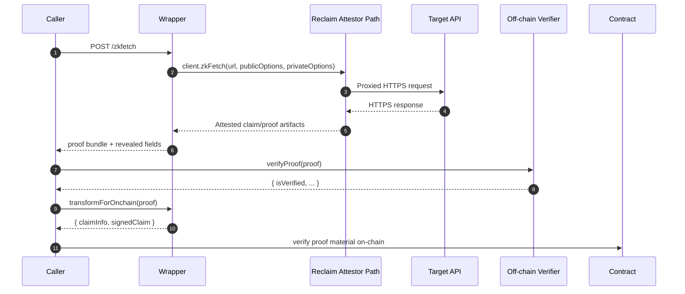

# Cryptographic Verification in Reclaim Protocol

## Scope (2026 Wrapper Stack)

This document explains verification in this repository using:
- `@reclaimprotocol/zk-fetch@1.0.0` for proof generation
- `@reclaimprotocol/js-sdk@5.x` for signature/claim verification
- Wrapper compatibility logic for structured js-sdk results (`isVerified`)

## Architecture Overview

**Two-Layer Verification System:**

Reclaim Protocol uses both zkSNARKs (Groth16) and ECDSA signatures for end-to-end verification.

### Layer 1: ZK-SNARK Proof (Groth16) - Selective Disclosure

**Generated**: Client-side using `@reclaimprotocol/zk-symmetric-crypto`
- **Algorithm**: Groth16 zkSNARK
- **Circuits**: Circom circuits (ChaCha20, AES-256-CTR, AES-128-CTR)
- **Backend**: snarkjs or gnark
- **Purpose**: Prove knowledge of TLS encryption keys without revealing them
- **Privacy**: Enables selective disclosure (reveal required fields, hide sensitive fields)
- **Location**: Generated locally on client device
- **Verification**:
  - Attestor-side: verified before signing
  - On-chain: not replayed as full transcript/ZK verification flow in this wrapper model

### Layer 2: Attestor Signatures (ECDSA)

**Signed**: By decentralized attestor network
- **Algorithm**: ECDSA (same primitive family used in Ethereum flows)
- **Purpose**: Attest that claim material was accepted against observed session context
- **Pre-signing**: Attestor verifies ZK/claim requirements before signing
- **Trust Model**: Attestor only signs accepted claims
- **Verification**: ECDSA signatures verified off-chain (`js-sdk`) or on-chain (contract logic)
- **Implementation**: `ethers.verifyMessage()` off-chain or Solidity `ECRECOVER` on-chain
- **What's signed**: Claim/signature material bound to identifier/owner/timestamp/epoch context

## Verification Layers in This Wrapper (2026)

### Layer A: Attested claim/proof creation
- Request runs through Reclaim attestor/proxy path.
- Attestor-side infrastructure validates claim material against observed session context before signing.
- Selective disclosure controls what is visible in returned proof data.

### Layer B: Signed-claim verification (off-chain and on-chain)
- Off-chain (`js-sdk`): verifies claim consistency and signed claim integrity.
- On-chain: verifies contract-required signed claim material.
- In js-sdk 5.x, result can be structured (for example, `isVerified`) rather than only a bare boolean.

### Layer C: Application-level checks in this wrapper
- Endpoint checks (`/verify`, `/verify-full`) combine signature validation with diagnostics.
- On-chain preparation (`/transform-onchain`) maps proof material to contract-call shape.

## How It Works

### Trust Model
1. Client connects through attestor proxy.
2. Attestor observes encrypted session traffic and context.
3. Client creates claim with selective disclosure.
4. Attestor signs accepted claim material.
5. Verifiers validate signatures and claim consistency.

### Benefits
- Fast verification path through signature checks.
- Cost-efficient on-chain verification compared to full proof replay.
- Privacy via selective disclosure.
- Decentralized witness/attestor trust model.

## Complete Verification Flow

```
┌─────────────────────────────────────────────────────────────┐
│ CLIENT SIDE                                                 │
├─────────────────────────────────────────────────────────────┤
│ 1. Connect to target API through attestor proxy             │
│ 2. Send HTTPS request (TLS encrypted)                       │
│ 3. Receive HTTPS response (TLS encrypted)                   │
│ 4. Decrypt response locally (have TLS session keys)         │
│ 5. Generate ZK proof locally                                │
│ 6. Create claim with selective disclosure                   │
│ 7. Send claim to attestor for signing                       │
└─────────────────────────────────────────────────────────────┘
                         ↓
┌─────────────────────────────────────────────────────────────┐
│ ATTESTOR SIDE (Proxy Server + attestor-core)                │
├─────────────────────────────────────────────────────────────┤
│ 8. Observes encrypted TLS traffic (proxied connection)      │
│ 9. Receives claim with embedded ZK proof from client        │
│10. Verifies required ZK/claim checks before signing         │
│11. Validates claim consistency with observed context        │
│12. Signs with ECDSA (only after verification passes)        │
│13. Returns signed claim/proof artifacts                     │
└─────────────────────────────────────────────────────────────┘
                         ↓
┌─────────────────────────────────────────────────────────────┐
│ VERIFIER - OFF-CHAIN (@reclaimprotocol/js-sdk)              │
├─────────────────────────────────────────────────────────────┤
│14. Verify ECDSA signatures and claim consistency            │
│15. Trust attestor-side ZK/claim verification path           │
│16. Consume only revealed fields                             │
└─────────────────────────────────────────────────────────────┘
                         ↓
┌─────────────────────────────────────────────────────────────┐
│ VERIFIER - ON-CHAIN (Contract Flow)                         │
├─────────────────────────────────────────────────────────────┤
│17. Verify contract-required signed claim material           │
│18. Rely on attestor-backed claim construction assumptions   │
│19. Revert if signatures/claim inputs are invalid            │
└─────────────────────────────────────────────────────────────┘
```

## End-to-End API Verification Flow (Wrapper Runtime)



## What Is Actually Verified

| Context | Verified | Not Verified |
|---|---|---|
| Off-chain (`js-sdk`) | Signed claim integrity, claim consistency | Full remote HTTPS session replay |
| On-chain contract flow | Contract-required signed claim material | Full transcript-level proof system replay |

## Signature Verification Mechanics

Common message shape used for signer recovery:

```text
identifier\nowner\ntimestamp\nepoch
```

Typical verifier-side mechanics:
1. Resolve expected witness set for claim epoch/selection rules.
2. Validate claim identity consistency.
3. Recover signer address(es) from ECDSA signature(s).
4. Compare recovered addresses to expected witness set.
5. Return verification verdict.

In 5.x SDK flows, return is often structured (for example `{ isVerified, ... }`).

## Code Locations

### ZK-SNARK Verification (Groth16)
**File**: `@reclaimprotocol/attestor-core/lib/utils/zk.js`

```javascript
// Main verification function
async function verifyZkPacket({ cipherSuite, ciphertext, zkReveal, ... }) {
    await verifyProofPacket(proof);
    await zk_symmetric_crypto_1.verifyProof({
        proof: { algorithm, proofData, plaintext },
        publicInput: { ciphertext, iv, offsetBytes },
        operator
    });
}
```

**File**: `@reclaimprotocol/zk-symmetric-crypto/lib/zk.js`

```javascript
// Groth16 verification
async function verifyProof(opts) {
    const publicSignals = getPublicSignals(opts);
    const { proof: { proofData }, operator, logger } = opts;

    verified = await operator.groth16Verify(publicSignals, proofData, logger);

    if (!verified) {
        throw new Error('invalid proof');
    }
}
```

### Signature Verification (ECDSA)
**File**: `@reclaimprotocol/js-sdk/dist/index.js`

```javascript
function verifyProof(proofOrProofs, allowAiWitness) {
    const witnesses = getWitnessesForClaim(claim);
    const expectedId = getIdentifierFromClaimInfo(claimInfo);
    assertValidSignedClaim(signedClaim, witnesses);
}

function recoverSignersOfSignedClaim(claim) {
    return claim.signatures.map(signature => {
        return ethers.verifyMessage(serializedClaim, signature);
    });
}
```

## Current Wrapper Behavior (2026)

- `/zkfetch` generates proof artifacts and returns metadata.
- `/verify` validates proof via `verifyProofCompat`:
  - tries `verifyProof(proof, { dangerouslyDisableContentValidation: true })`
  - falls back to `verifyProof(proof)`
  - normalizes structured/boolean results to a strict boolean.
- `/verify-full` adds expanded diagnostics path.
- `/transform-onchain` prepares `claimInfo` + `signedClaim` for contract calls.

## Local ZK Verification in This Repo

The `zk-verify.js` module can:
1. Extract ZK proof data when available.
2. Attempt local Groth16 verification using attestor-core-compatible logic.
3. Support debugging/auditing paths.

Practical note:
- Some current proof shapes in wrapper flows may not include all reveal artifacts needed for local replay verification.
- Signature verification remains the primary always-available verification path.

## On-Chain Verification

### Current Implementation Model
- Verifies witness ECDSA signatures.
- Checks witness/epoch-based claim rules.
- Validates identifier and claim consistency per contract expectations.
- Does not replay full transcript-level ZK verification on-chain in this wrapper flow.

### Why no full on-chain ZK replay in this flow
1. High gas cost for heavy proof verification.
2. Attestor-backed trust model for practical performance.
3. Multisigner witness model for resilience.
4. Better throughput for production integration paths.

## Real Payloads (Snapshot: 2026-07-21)

Note: identifiers, timestamps, signatures, and extracted values vary by run.

### A. Direct zkFetch-style payload (httpbin/get)

Request pattern used in tests (`tests/test-httpbin-origin.js`):

```json
{
    "url": "https://httpbin.org/get",
    "publicOptions": {
        "method": "GET",
        "headers": {
            "accept": "application/json"
        }
    },
    "privateOptions": {
        "responseMatches": [
            {
                "type": "regex",
                "value": "\"origin\":\\s*\"(?<origin>[^\"]+)\""
            }
        ]
    }
}
```

Observed proof excerpt (`proof-structure.json`, generated on 2026-07-21):

```json
{
    "claimData": {
        "provider": "http",
        "parameters": "{\"body\":\"\",\"headers\":{\"User-Agent\":\"reclaim/0.0.1\",\"accept\":\"application/json\"},\"method\":\"GET\",\"responseMatches\":[{\"type\":\"regex\",\"value\":\"\\\"origin\\\":\\\\s*\\\"(?<origin>[^\\\"]+)\\\"\"}],\"responseRedactions\":[],\"url\":\"https://httpbin.org/get\"}",
        "context": "{\"extractedParameters\":{\"origin\":\"65.1.230.217\"},\"providerHash\":\"0x245a11f715ca085fabe2986526a51e43f286650f992dde2d036daf2f16fc1370\"}",
        "identifier": "0xfd847f3bbdf497d5616c2d7f8124dfa27a441ff25accade97a01db3fe657891b",
        "epoch": 1
    },
    "witnesses": [
        {
            "id": "0x244897572368eadf65bfbc5aec98d8e5443a9072"
        }
    ]
}
```

### B. Wrapper API payload (`/zkfetch`) with redaction

Request pattern used in integration tests (`tests/test-selective-disclosure.js`):

```json
{
    "url": "https://httpbin.org/json",
    "publicOptions": {
        "method": "GET"
    },
    "privateOptions": {
        "responseMatches": [
            {
                "type": "contains",
                "value": "\"title\": \"Overview\""
            }
        ]
    },
    "redactions": [
        {
            "jsonPath": "$.slideshow.slides"
        }
    ]
}
```

Observed generated proof excerpt (`generated_proof.json`, generated on 2026-07-21):

```json
{
    "claimData": {
        "provider": "http",
        "parameters": "{\"body\":\"\",\"method\":\"GET\",\"responseMatches\":[{\"type\":\"contains\",\"value\":\"\\\"title\\\": \\\"Overview\\\"\"}],\"responseRedactions\":[{\"jsonPath\":\"$.slideshow.slides\"}],\"url\":\"https://httpbin.org/json\"}",
        "identifier": "0x0c17450a6d60d66050971c7d370dbaf43396f16a3b6df58c8f6a7ef81ce1f016",
        "epoch": 1
    },
    "witnesses": [
        {
            "id": "0x244897572368eadf65bfbc5aec98d8e5443a9072"
        }
    ]
}
```

### C. Wrapper verification response (`/verify`)

Observed response shape when verifying an origin-extraction proof:

```json
{
    "success": true,
    "valid": true,
    "extractedData": {
        "origin": "65.1.230.217"
    }
}
```

Note: `extractedData` depends on proof content. Some selective-disclosure payloads may include different keys or omit extraction fields.

## Security Considerations

### What Attestor Signatures Prove
- Attestor observed encrypted TLS traffic context.
- Attestor accepted claim/proof material before signing.
- Claim metadata and signature set are internally consistent.
- Epoch/timestamp constraints are part of verification context.

### What They Do Not Prove
- Upstream business truthfulness of API data.
- Elimination of trust assumptions in witness/attestor infrastructure.
- Absolute prevention of collusion risks across all environments.

### Privacy Notes
- Sensitive request/response portions can remain undisclosed via private options/redactions.
- Verifiers consume only intentionally revealed outputs.
- Attestor path may still observe service-level metadata (timing/target-domain context).

## Testing in This Repo

```bash
# Off-chain verification + extraction flows
node tests/test-httpbin-origin.js
node tests/test-sdk-verification.js

# On-chain preparation and contract-side compatibility checks
node tests/test-onchain-quick.js
node tests/test-onchain.js

# Server integration path (wrapper endpoints)
node tests/test-selective-disclosure.js
```

## Practical Caveats
- Keep `zk-fetch` and `js-sdk` versions aligned when upgrading.
- Restart wrapper process after dependency upgrades.
- Ensure test payload examples are regenerated when SDK behavior changes.

## References
- Reclaim docs: https://docs.reclaimprotocol.org/
- zk-fetch package: https://www.npmjs.com/package/@reclaimprotocol/zk-fetch
- js-sdk package: https://www.npmjs.com/package/@reclaimprotocol/js-sdk
- Groth16 paper: https://eprint.iacr.org/2016/260.pdf
- snarkjs: https://github.com/iden3/snarkjs
