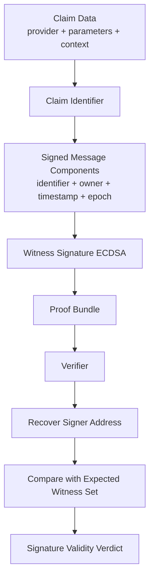
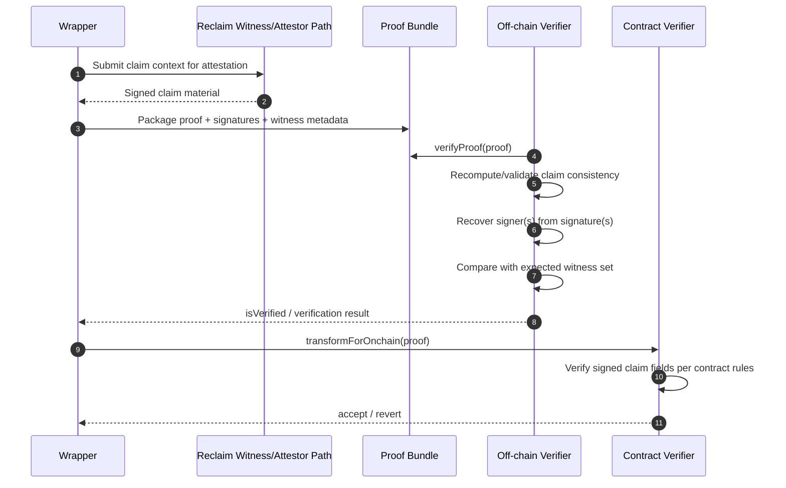

# Reclaim Signature Analysis

## Scope
This document explains what witness signatures prove in this repository and how signature validation is performed in practice.

## Core Idea
Reclaim proof validation here is signature-centric:
- Witnesses attest to claim material and sign it.
- Verifiers validate signed claim integrity.
- Selective disclosure controls which extracted values are visible to verifiers.

## How It Works

1. Claim definition is created from provider, request parameters, matching rules, and context.
2. Claim identity (`identifier`) is derived from that claim information.
3. Witnesses sign claim-bound metadata (identifier, owner, timestamp, epoch).
4. Proof bundle includes signatures plus witness metadata.
5. Verifier recovers signer addresses from signatures.
6. Verifier compares recovered signers against expected witness set.
7. Verification succeeds only when claim consistency and signer matching both pass.

This model ensures signatures are tied to the exact claim identity, not just to a free-form response string.

## Why This Design

- Efficiency:
    - Signing a compact claim identity + metadata is cheaper than signing large raw payloads.
    - Verification is lightweight (ECDSA recovery and witness-set checks).

- Integrity binding:
    - Any change in claim structure (for example `responseMatches`, redactions, URL, method, context) changes claim identity and invalidates signatures.

- Replay resistance:
    - Timestamp and epoch are part of the signed material, reducing replay risk across witness windows.

- Privacy compatibility:
    - Selective disclosure can hide sensitive content while preserving verifiable signed claim identity.

- Verifier practicality:
    - Off-chain and on-chain consumers can validate claim authenticity without re-running full remote session logic.

## Signature-Binding Model

The signed payload is bound to claim identity and metadata, not to a raw response body dump.

Conceptually, signatures bind these fields:
- identifier
- owner
- timestamp
- epoch

This is why tampering with claim metadata causes verification failure.

### Canonical Message Shape (Retained Detail)

The witness-signed message used by SDK verification is represented as:

```text
identifier\nowner\ntimestamp\nepoch
```

Example reconstruction:

```javascript
const message =
    proof.claimData.identifier.toLowerCase() + '\n' +
    proof.claimData.owner.toLowerCase() + '\n' +
    proof.claimData.timestampS + '\n' +
    proof.claimData.epoch;
```

Ethereum-style verification (`ethers.verifyMessage`) applies the EIP-191 signed-message prefix internally before signature recovery.

## Signature Flow Diagram



## End-to-End Verification Sequence



## Relationship to responseMatches

`responseMatches` and redaction settings affect claim content and extracted outputs, but signatures still validate claim identity and signer authenticity.

In short:
- `responseMatches` influences what is proven/revealed.
- Signatures attest to the resulting claim identity and metadata.

### Claim Data Relationship (Retained Detail)

Signatures do not sign `responseMatches` directly as a standalone field. Instead:
1. `responseMatches` and redaction rules become part of claim parameters/context.
2. Claim identity (`identifier`) is derived from claim information.
3. Witness signatures bind to that identifier + metadata tuple.

So changing `responseMatches` semantics changes claim identity and invalidates existing signatures.

Representative claim shape:

```json
{
    "provider": "http",
    "parameters": "{... responseMatches/responseRedactions ...}",
    "context": "{... extractedParameters/providerHash ...}",
    "identifier": "0x..."
}
```

### Selective Disclosure Regex Example

A representative extraction rule used in tests is:

```regex
"origin":\s*"(?<origin>[^"]+)"
```

This influences claim parameters/context, which then affect `identifier`; signatures remain bound to the resulting claim identity tuple.

## What Signatures Prove

Signatures provide evidence that:
- A valid witness/attestor signer attested this claim identity.
- The signed claim metadata is consistent (identifier-owner-timestamp-epoch binding).
- The proof was not modified after signing.

Signatures do not prove:
- Business truth of upstream API data.
- That every hidden field is visible to verifier (by design).

## Practical Verification in This Repo

Off-chain checks:
- Wrapper and tests use js-sdk verification flow.
- With js-sdk 5.x, normalize structured results (for example `isVerified`).

On-chain checks:
- Use transformed structures (`claimInfo`, `signedClaim`) and contract verification paths.
- Contract validates signed claim material per ABI expectations.

### SDK Verification Steps (Retained Detail)

Practical flow performed by js-sdk verification logic:
1. Resolve expected witness set for claim epoch/selection rules.
2. Recompute claim identity consistency from claim info.
3. Recover signer address(es) from signatures.
4. Compare recovered signers with expected witness set.
5. Return verification result (`boolean` in older flows, structured result in 5.x flows).

### Witness Selection Deep Dive

In contract-backed verification paths, witness expectation commonly follows this model:
1. Resolve claim epoch and timestamp window.
2. Derive deterministic witness set for the claim selection rule.
3. Compare recovered signer addresses to that expected set.

Representative function names seen across SDK/contract implementations include patterns such as `getWitnessesForClaim(...)` and `fetchWitnessesForClaim(...)`.

Note: Exact implementation details can vary by SDK/chain version; keep this section aligned with the deployed contract and current js-sdk behavior.

## Minimal Example

```javascript
const { ethers } = require('ethers');

const msg = `${proof.claimData.identifier}\n${proof.claimData.owner}\n${proof.claimData.timestampS}\n${proof.claimData.epoch}`;
const recovered = ethers.verifyMessage(msg, proof.signatures[0]).toLowerCase();
const expected = proof.witnesses[0].id.toLowerCase();

console.log('signatureValid', recovered === expected);
```

## Real Signature Payload (Snapshot: 2026-07-21)

Note: identifiers, timestamps, signatures, and extracted values vary by run.

Source artifact:
- `proof-structure.json`

Extracted values from real test output:

```json
{
    "identifier": "0xfd847f3bbdf497d5616c2d7f8124dfa27a441ff25accade97a01db3fe657891b",
    "owner": "0x6202d6e4b1c98f4e7e22d7b969dec142aa282ec6",
    "timestampS": 1784671457,
    "epoch": 1,
    "signature": "0xfeb59602d31488865555beeca1f6cf648e80318990d60956108c914738cb46742d55295e16dfe7a3daa8f5cd30c2b1e49587eeae9e06b7a01efc333868ae77dd1c",
    "witnessId": "0x244897572368eadf65bfbc5aec98d8e5443a9072",
    "recoveredSigner": "0x244897572368Eadf65bfBc5aec98D8e5443a9072"
}
```

Canonical message reconstructed for verification:

```text
0xfd847f3bbdf497d5616c2d7f8124dfa27a441ff25accade97a01db3fe657891b
0x6202d6e4b1c98f4e7e22d7b969dec142aa282ec6
1784671457
1
```

## Troubleshooting

- If verification unexpectedly fails or hangs, ensure no stale local server process is serving old code.
- Ensure js-sdk and zk-fetch versions are aligned with current repo dependencies.
- Re-run proof generation after dependency upgrades before re-verifying old artifacts.

## Security Implications (Retained Detail)

What signature validation gives you:
- Claim integrity binding (identifier + owner + timestamp + epoch).
- Replay resistance via timestamp and epoch constraints.
- Witness accountability through signer recovery and witness-set matching.

What it does not automatically give you:
- Business correctness of upstream API output.
- Elimination of witness trust assumptions.

## Open Questions for Deep Dives

- Exact identifier derivation details across SDK/attestor versions.
- Witness-set rotation/epoch policy and chain configuration drift risks.
- Behavioral differences between off-chain js-sdk checks and specific on-chain contract implementations.

## Key Takeaway

In this wrapper, signatures are the primary verifiable anchor: they bind witness attestation to claim identity, while selective disclosure controls what data is revealed to the verifier.